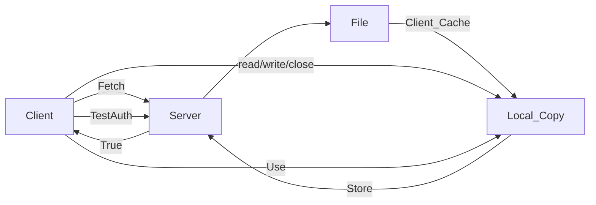

#### AFS-1

- Whole-file caching

![[AFS 1.png]]

##### Problems
- High path traversal cost
- The client issues too many TestAuth protocol msgs
- Load is not balanced (solved using volumes)
- Single process per client - increased context switching overhead (switched to threads)

#### AFS-2

> [!info] 
> - Callback - server will tell if file changes
> - File identifier - similar to file handle in NFS

-  AFS makes an exception to this simple model between processes on the same machine. In this case, writes to a file are immediately visible to other local processes (i.e., a process does not have to wait until a file is closed to see its latest updates). 

> [!important] 
> **last writer wins** - whichever client calls close() last will update the entire file on the server last and thus will be the “winning” file.

##### Crash Recovery
- If client crashes, it should treat all cached files as suspect and test with TestAuth.
- callbacks are kept in memory; thus, when a server reboots, it has no idea which client machine has which files. Thus, upon server restart, each client of the server must realize that the server has crashed and treat all of their cache contents as suspect, and (as above) reestablish the validity of a file before using it. (**heartbeat** message, periodic ping)

##### Scalability
![[afs vs nfs.png]]

Similar performance

AFS - global namespace (all files are named same on machine), security, user-authentication, user-managed access control, simpler management of servers for administrators
NFS - allow to mount server in any way they please, primitive security, primitive sharing

