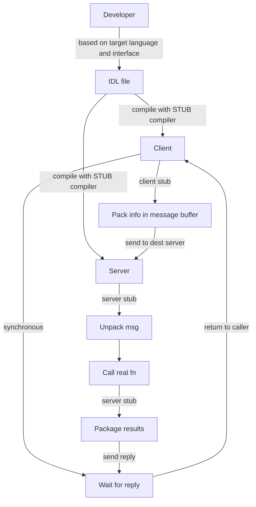

> [!failure] 
> Failure of machine, disk, network, and software; but appear to the client as if the server never fails.
> 

> [!info] 
> 3 components: system performance, connection security and communication.
> 

#### Communication

> [!caution] 
> Packet loss is one of the biggest challenges - other (damaged machine/router,) 

##### Unreliable Layer
- UDP/IP networking stack uses sockets API in order to create communication endpoint. Processes on other/same machine send **datagram** (fixed-sized message up to some max size) to the original process.
	- Includes a checksum to detect packet corruption

##### Reliable Layer

> [!info] 
> 1. **ack** -> acknowledgement by server to client of receiving
> 2. **retry/timeout** -> send msg again after some time if no ack received.
> 3. **sequence timer** -> start from a server-client agreed value which serves as an ID for a msg and is updated independently on both machines if the msg is successfully received or ack is received.

![[reliable network layer.png]]

> [!tip] 
> TCP/IP 

##### Communication Abstractions
- **DSM** (Distributed Shared Memory) - systems enable processes on different machines to share a large, virtual address space.
	- This abstraction turns a distributed computation into something that looks like a multi-threaded application. 
> [!fail] 
> Nobody uses DSM in modern distributed systems due to these reasons:
> - If a machine fails, what happens to the pages on the machine
> - If the data structures of the distributed computation are spread across the entire address space, parts of these data structures would suddenly become unavailable.
> - Memory access is cheap, but page faults result in expensive fetches from remote machine.

#### RPC (Remote Procedure Call)

> [!info] 
> **Programming language abstraction** to make the process of executing code on a remote machine as simple and straight-forward as calling a local function. Thus, to a client, a procedure call is made, and some time later, the results are returned.

![[rpc.png]]

##### Stub Generator (protocol compiler)

> [!warning] 
> **Problems & Solutions**:
> - <u>Complex  Arguments</u>: such as data structures or pointers
> 	- solved using well-known types like `buffer_t` or by *annotating* ds with more info.
> - <u>Concurrency on Server</u>: *thread pool* main thread receives request and gives to worker threads

##### Run-Time Library

> [!info] 
> A runtime system, on the other hand, is a set of libraries and services that provide a *framework* for managing the execution of the client and server programs, as well as the communication between them. The runtime system typically includes components for managing network connections, serializing and deserializing data, process management, error handling, and other low-level details of networking and messaging. 

**Issues Handled**
- <u>Naming</u> - hostname/ip:port
- <u>Protocol used</u> - unreliable layer UDP (low latency) with sufficient acks,timeout/retry and sequence numbering. TCP (if reliability is imp)
- <u>Long wait time to complete</u> - ack from server if reply isn't immediately generated and periodic checks by client to server.
- <u>Args bigger than packets</u> - sender-side *fragmentation* and receiver-side *reassembly*
- <u>Byte ordering</u> - big/little endian -> converted as done by Sun RPC XDR if different
- <u>Synchronous waits</u> - asynchronous for performance optimization
	- The client at some point will want to see the results of the asynchronous RPC; it thus calls back into the RPC layer, telling it to wait for outstanding RPCs to complete, at which point return arguments can be accessed.

> [!important] 
> To differentiate between stubs and runtime systems in RPC, you can think of the stub as the component that handles the marshalling and unmarshalling of function arguments and results, and the runtime system as the component that provides the overall framework for managing the execution of the client and server programs and the communication between them.

