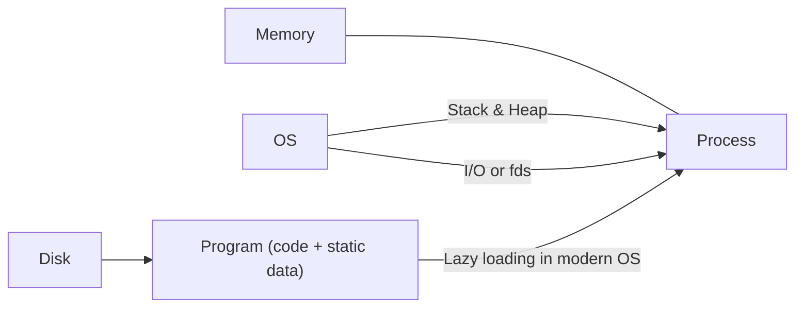

> [!info] 
> It is a running program. 
> - The **program** itself is a lifeless thing: it just sits there on the disk, a bunch of instructions (and maybe some static data), waiting to spring into action.

##### CPU Virtualization

> [!info] 
> - Low-level machinery mechanisms like time sharing, context switching (space sharing is another example)
> - High level intelligence like OS scheduling policies
 
By running one process, then stopping it and running another, and so forth, the OS can
promote the illusion that many virtual CPUs exist when in fact there is only one physical CPU (or a few) - ====**time sharing**==== - allows users to run as many concurrent processes as they would like; the potential cost is performance, as each will run more slowly if the CPU(s) must be shared.

====**Policies**==== are algorithms for making some kind of decision within the OS. For example, given a number of possible programs to run on a CPU, which program should the OS run? A
scheduling policy in the OS will make this decision, likely using historical information (e.g., which program has run more over the last minute?), workload knowledge (e.g., what types of programs are run), and performance metrics (e.g., is the system optimizing for interactive performance, or throughput?) to make its decision.

Modularity -> separating high level intelligence from low level machinery implementation.

#### Process

> [!info] 
> Machine state
>  - address space -> memory of process
>  - registers -> many instructions explicitly read or update registers.
> 	 - program counter/ instruction pointer
> 	 - stack and frame pointer
> - i/o information

##### Process API
1. **Create**: method to create new processes.
2. **Destroy**: kill/destroy processes forcefully.
3. **Wait**: wait for process to stop running.
4. **Miscellaneous Control**: other commands -> suspend & resume
5. **Status**: status info about process (duration, state)

##### Process Creation

![[program loading.png]]

- **Stack**: for local variables, function parameters, and return addresses.
	- OS will also likely initialize the stack with arguments; specifically, it will fill in the parameters to the main() function, i.e., argc and the argv array.
- **Heap**: for explicitly requested dynamically-allocated data (`malloc and free`)
	- needed for data structures such as linked lists, hash tables, trees, and other interesting data structures.
	- Small at first but can be increased via `malloc` which is handled by OS.
- **I/O**: by default has three open file descriptors, for standard input, output, and error.

##### Process States

![[process states.png]]

- **Running**: executing instructions on processor
- **Ready**: ready to run but for some reason the OS has chosen not to.
- **Blocked**: performed some kind of operation that makes it not ready to run until some other event takes place. Ex: I/O

> [!tip] 
> OS **scheduler** decides state of process 

##### Process Data Structure

OS stores all running processes in a **process list**.

![[pcb.png]]

Process Control Block (**PCB**) - ds that stores info about process

> [!tip] 
> Registers store imp info about process which gets copied to mem whenever a process is stopped during context switch.
> 

- **Zombie** process state helps a parent process of the state to get output (return code) from the finished child process before the `wait()` command completes and OS destroys related data.